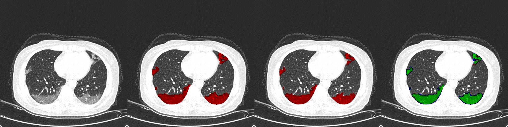

# Introductory Demo

This part demostrates how to use our trained model to predict an example CT scan.

## Usage

### Download Data
Download Data from [this Google Drive link](https://drive.google.com/drive/folders/1_-W8HcHpnBS_9Hkz6P5QfE6Gw-pNXxZ7?usp=sharing). Place the folders `datasets/` and `checkpoint/` inside the drive in the repository folder.

### Install Dependencies

Run command
```
conda create -n newenv --file requirements.txt
```
This will install all the dependencies to run the program. You are free to change ``newenv`` to any name you like for the environment.

Then activate the environment
```
conda activate newenv
```

### Run

Run command
```
python test.py
```

### Output

The 3D prediction result will be stored in `prediction/`. Viewable png slices of the array will be stored in `prediction_visualization/`.


<div align="center">
  
</div>

The above is one image slice from `prediction_visualization/`. From left to right: (1) original CT image (2) prediction (3) ground truth (4) green regions are true positives, blue regions are false positives and red regions are false negatives.

