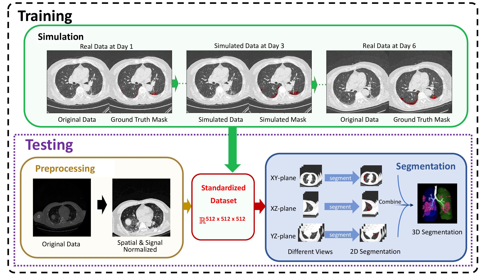

# (TODO) Seeing the Unseen: Discovering Interpretable Sub-Visual Abnormalities in CT Scans of COVID-19 Patients and Survivors by Deep Learning
## Overview

<div align="center">
  
</div>
This repository provides the predictive model described in the paper:

```
Longxi Zhou, et al. "Seeing the Unseen: Discovering Interpretable Sub-Visual Abnormalities in CT Scans of COVID-19 Patients and Survivors by Deep Learning"
```

## Contents
- 01.introductory.demo contains and example prediction of our model
- 02.our.model contains our full-fledged model

The trained models of our model and the baseline methods are stored on [Google Drive](https://drive.google.com/drive/folders/16ZvZfhqMmuF7wqNPKUOntw2P-Mfx5C4l?usp=sharing). Please respect the folder structure in the drive when downloading. 

### Example Data on the Google Drive:
The data for `02.our.model` is in in `02.our.model/patients/`. Our method will preprocessing these files, predict, enhance and visualize the final effects.
Read the `readme` files for these comparisions for detailed information.

## Contact

If you request our training code for DLPE method, please contact Prof. Xin Gao at xin.gao@kaust.edu.sa.

test
