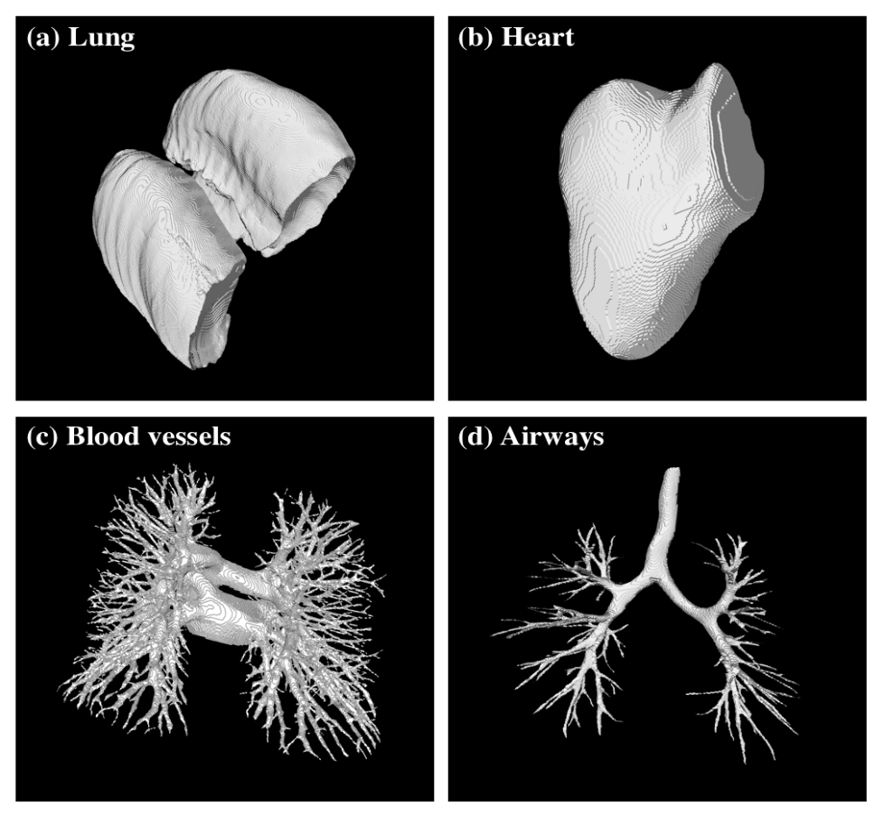
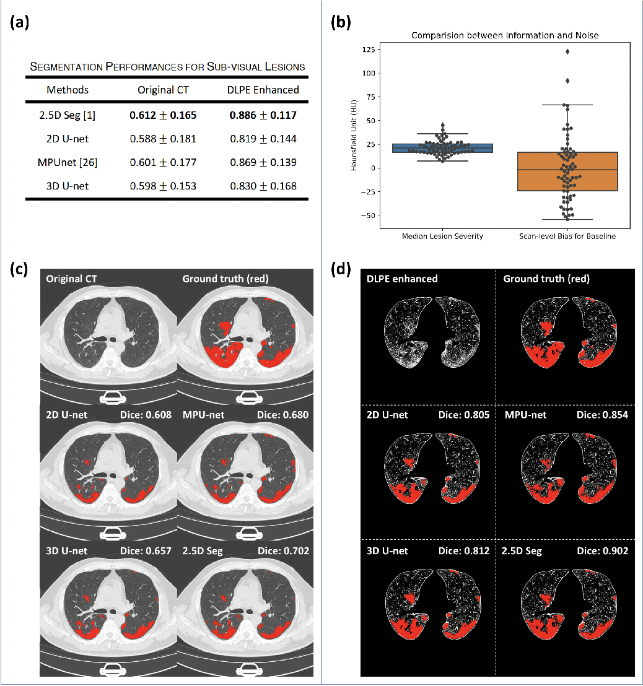
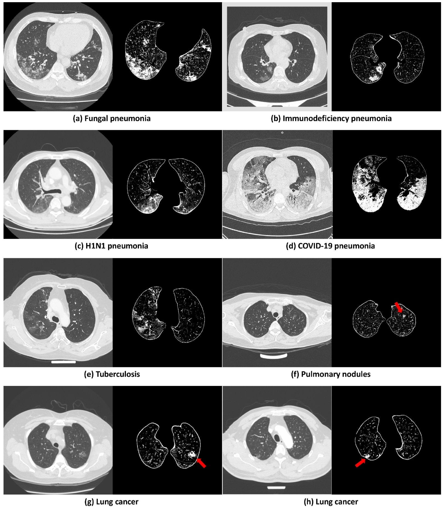
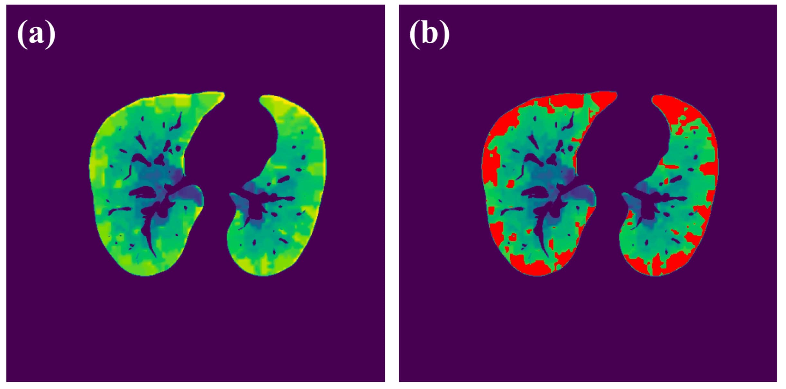
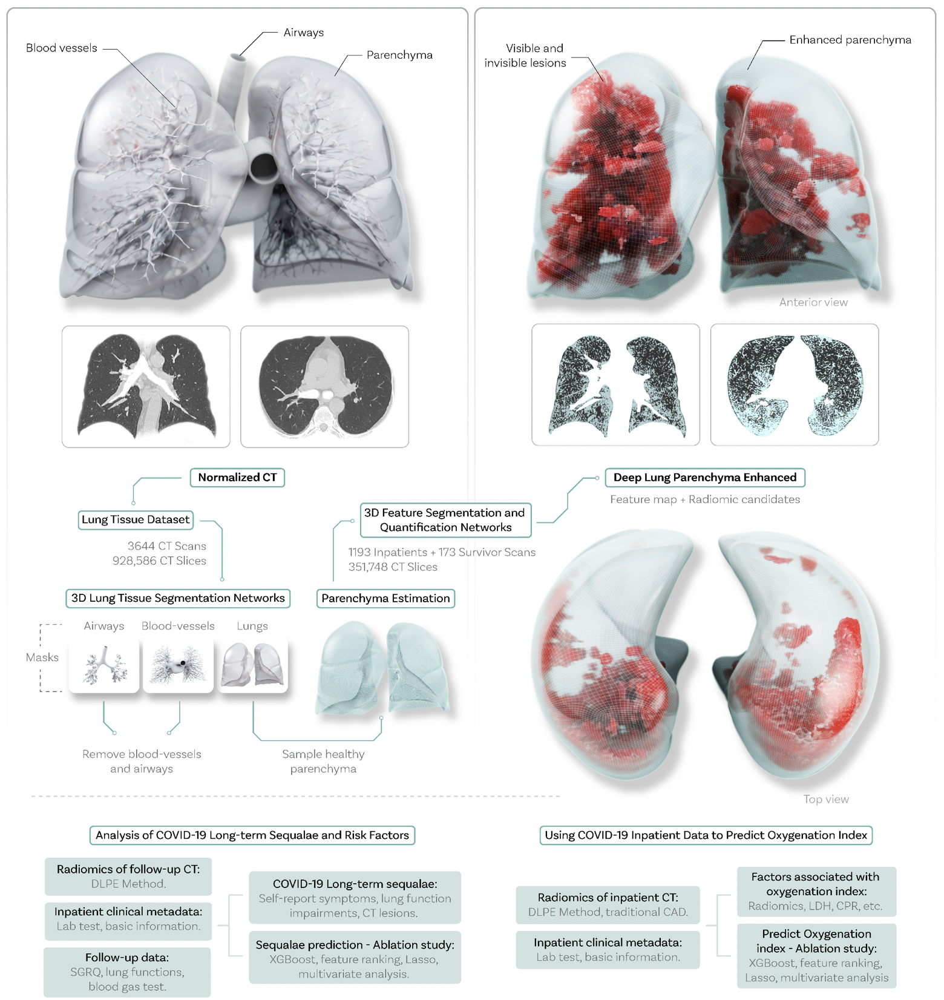

# An Interpretable Deep Learning Workflow for Discovering Sub-Visual Abnormalities in CT Scans of COVID-19 Inpatients and Survivors
## Overview
This repository provides the method described in the paper:
```
Longxi Zhou, et al. "An Interpretable Deep Learning Workflow for Discovering Sub-Visual Abnormalities in CT Scans of COVID-19 Inpatients and Survivors", Accepted by Nature Machine Intelligence.
```
## Here You Can Find:
- Fast and state-of-the-art segmentation models for COVID-19 lesions, lungs, airways and blood vessels.
- The first segmentation model for COVID-19 sub-visual lesions.
- A method to remove scan-level bias of chest CT data.
- A method to calculate the optimal window for observing pulmonary parechyma.
- A method to quantify good radiomics.

## Use DLPE method For:

### Get Fast, Accurate and Robust Segmentations!
<div align="center">
  
</div>

### Remove Scan-level Bias: Same Model, Same Training Protocol, Same Ground Truth, DIFFERENT Performance!
<div align="center">
  
</div>

### Observe Lesions and Quantify Spatial Distribution!
<div align="center">
  
</div>
<div align="center">
  
</div>

## Description
Deep-LungParenchyma-Enhancing (DLPE) is a computer-aided detection (CADe) method for detecting and quantifying pulmonary parenchyma lesions on chest computerized tomography (CT). Using deep-learning, DLPE removes irrelevant tissues other than pulmonary parenchyma, and calculates the scan-level optimal window which enhances parenchyma lesions for dozens of times compared to the lung window. Aided by DLPE, radiologists discovered novel and interpretable lesions from COVID-19 inpatients and survivors, which are previously invisible under the original lung window and have strong predictive power for key COVID-19 clinical metrics and sequelae.

### Workflow for DLPE Method
<div align="center">
  
</div>

## Run DLPE Method
- Step 1): Download the file: "trained_models/" and "example_data/" from [Google Drive](https://drive.google.com/drive/folders/16ZvZfhqMmuF7wqNPKUOntw2P-Mfx5C4l?usp=sharing).
- Step 2): Dowload the source codes from github (note in github, "trained_models/" and "example_data/" are empty files).
- Step 3): Replace the "trained_models/" and "example_data/" with Google Drive downloaded.
- Step 4): Establish the python environment by 'resources/req.txt'.
- Step 5): Open 'interface/dcm_to_enhanced.py', follow the instructions to change global parameters "trained_model_top_dict", "dcm_directory" and "enhance_array_output_directory".
- Step 6): Run 'interface/dcm_to_enhanced.py'.

## Time and Memory Complexity
- DLPE method requires GPU ram >= 6 GB and CPU ram >= 24 GB.
- Enhancing one chest CT scan needs about two minutes on one V100 GPU.

## Reproduce Our Follow-up Results
- Step 1): Open "Reproduce Follow-up Dataset/rescaled_ct_compressed/" from [Google Drive](https://drive.google.com/drive/folders/16ZvZfhqMmuF7wqNPKUOntw2P-Mfx5C4l?usp=sharing). All normalized follow-up CT scans are stored here. Each normalized scan is a 'float32' numpy array with shape (512, 512, 512).
- Step 2): Load one of these normalized scan.
- Step 3): Open 'interface/dcm_to_enhanced.py', see line 22. Change the "rescaled_ct_array" with what you loaded in Step 2).
- Step 4): Run the following part of 'interface/dcm_to_enhanced.py'. You will get the enhanced arrays used in our study. You may also check the segmentations for lungs, airways and blood vessels, e.g. visualize them in 3D stl. Many hospitals already used our models to segment airways and blood vessels for operations.
- All expected outputs including lung masks, airway masks, blood vessel masks and the enhanced arrays for follow-up CT are stored in "Reproduce Follow-up Dataset/expected_outputs/" from [Google Drive](https://drive.google.com/drive/folders/16ZvZfhqMmuF7wqNPKUOntw2P-Mfx5C4l?usp=sharing). "Reproduce Follow-up Dataset/visualize_chest_tisse_seg/" stores the 2D semantic map for lungs (green), airways (blue) and blood vessels (red).

## Contact
If you request our training code for DLPE method, please contact Prof. Xin Gao at xin.gao@kaust.edu.sa.

## Cite:
[](https://zenodo.org/badge/latestdoi/398192728)

## License
[BSD 3-Clause "New" or "Revised" license](https://github.com/LongxiZhou/DLPE-method/blob/master/LICENSE)
